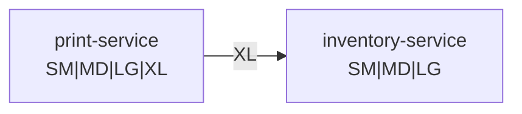

# Wire-safe enums

Wrapper class for enums that supports deserialization of unknown enum values. This is
especially useful when handling enums sent across the wire between different JVMs, where
an enum value may not be known.

## Example

Suppose we run a custom tee shirt printing business. In this example, we have two services:

- `inventory-service` - tracks how many shirts are available in each size (`SM`, `MD`, `LG`), material, etc.
- `print-service` - receives requests to print shirts, and updates the inventory via `inventory-service`

Let's say the sizes we support are represented as an enum in a shared library, and that we want
to add a new `XL` shirt size:
```kotlin
enum class TeeShirtSize {
  SM,
  MD,
  LG,
  XL, // New size!
}
```
Before it's safe to use the new value, **both** `inventory-service` and `print-service` would
need to be deployed. If either service has not been deployed with the updated enum, its JSON
parsing library will fail to parse `"XL"`, because it's not one of the known `TeeShirtSize`
values in the JVM. 



In the example above, `print-service` has been deployed since the shared library was updated, so it
knows about the new `XL` value. We can see, though, that `inventory-service` has not yet been deployed,
so it's unaware of the new enum constant. This means that when it receives a JSON value of `"XL"` from
`print-service`, it will fail to deserialize the `TeeShirtSize`.

`WireSafeEnum` prevents such JSON deserialization failures, by deserializing into "known" or "unknown
wrapper types, which allows more graceful handling of unknown values. This is important because it
relaxes the requirements for distributed systems to be deployed in specific (and strict) order before
new values may be used.

> [!IMPORTANT]
> Note: `WireSafeEnum` does not solve the issue of actually handling the unknown values. It simply
> provides a more controlled way to manage unknown value deserialization (and re-serialization).
> You'll still need to figure out what behavior makes sense for your use-case.

## API

A `WireSafeEnum` can be either `Known` (the value is known to the current JVM) or
`Unknown` (the value is not known to the current JVM). Convenience methods are available
for constructing instances of `WireSafeEnum`, as well as an extension method on all enums
to allow easy conversion.

```kotlin
// Extension method provided for wrapping
val known = TeeShirtSize.MD.wireSafe()

// Known and Unknown can be created via factory methods
val otherKnown = WireSafeEnum.known(TeeShirtSize.MD)
val unknown = WireSafeEnum.unknown("XL")

// Unwrap using helper method
val unwrappedKnown: TeeShirtSize? = known.unwrap() // TeeShirtSize.MD
val unwrappedUnknown: TeeShirtSize? = unknown.unwrap() // null
```

## JSON Serialization

If the JSON string representing an enum can be successfully deserialized into an enum
constant, it will be wrapped in a `Known`, otherwise the (unquoted) JSON string will be
wrapped in an `Unknown`. Several common JSON serialization libraries are supported:

<details>
<summary><b>Jackson</b></summary>

### Installation:
**Gradle:**
```kotlin
// com.egoodhall:wire-safe-enums is exposed as `api`, so you only need this dependency
implementation("com.egoodhall:wire-safe-enums-jackson:${VERSION}")
```
**Maven:**
```xml
<dependency>
  <groupId>com.egoodhall</groupId>
  <artifactId>wire-safe-enums-jackson</artifactId>
  <version>${VERSION}</version>
</dependency>
```

### Usage
Jackson support for `WireSafeEnum` is provided by the `WireSafeEnumModule`. Registering it with the
ObjectMapper will provide `JsonSerializers`/`JsonDeserializer`s that support the generics needed by
`WireSafeEnum`.

```kotlin
// Register the WireSafeEnumModule with the ObjectMapper 
val mapper = ObjectMapper().apply {
  registerKotlinModule()
  registerModule(WireSafeEnumModule())
}

// Use the ObjectMapper to convert known values to/from JSON
val known = mapper.readValue<WireSafeEnum<TeeShirtSize>>("\"MD\"") // Known(TeeShirtSize.MD)
val knownJson = mapper.writeValueAsString(known) // "MD"

// Use the ObjectMapper to convert *unknown* values to/from JSON
val unknown = mapper.readValue<WireSafeEnum<TeeShirtSize>>("\"XL\"") // Unknown("XL")
val unknownJson = mapper.writeValueAsString(unknown) // "XL"
```

</details>

<details>
<summary><b>kotlinx.serialization</b></summary>

### Installation:
**Gradle:**
```kotlin
// com.egoodhall:wire-safe-enums is exposed as `api`, so you only need this dependency
implementation("com.egoodhall:wire-safe-enums-kotlinx:${VERSION}")
```
**Maven:**
```xml
<dependency>
  <groupId>com.egoodhall</groupId>
  <artifactId>wire-safe-enums-kotlinx</artifactId>
  <version>${VERSION}</version>
</dependency>
```

### Usage
kotlinx.serialization support for `WireSafeEnum` is provided by the `WireSafeEnumModule`. Registering
it with the `Json` instance will provide a `WireSafeEnumSerializer` that supports the generics needed by
`WireSafeEnum`.

```kotlin
// Register the WireSafeEnumModule with the Json instance
val mapper = Json { serializersModule = WireSafeEnumModule }

// Use the Json instance to convert known values to/from JSON
val known = mapper.decodeFromString<WireSafeEnum<TeeShirtSize>>("\"MD\"") // Known(TeeShirtSize.MD)
val knownJson = mapper.encodeToString(known) // "MD"

// Use the Json instance to convert *unknown* values to/from JSON
val unknown = mapper.decodeFromString<WireSafeEnum<TeeShirtSize>>("\"XL\"") // Unknown("XL")
val unknownJson = mapper.encodeToString(unknown) // "XL"
```

</details>

<details>
<summary><b>Moshi</b></summary>

### Installation:
**Gradle:**
```kotlin
// com.egoodhall:wire-safe-enums is exposed as `api`, so you only need this dependency
implementation("com.egoodhall:wire-safe-enums-moshi:${VERSION}")
```
**Maven:**
```xml
<dependency>
  <groupId>com.egoodhall</groupId>
  <artifactId>wire-safe-enums-moshi</artifactId>
  <version>${VERSION}</version>
</dependency>
```

### Usage
Moshi support for `WireSafeEnum` is provided by the `WireSafeEnumAdapterFactory`. Registering it
with the `Moshi` builder will provide a `JsonAdapter` that supports the generics needed by
`WireSafeEnum`.

```kotlin
// Register the WireSafeEnumModule with the Moshi builder
val moshi = Moshi.Builder()
  .add(WireSafeEnumAdapterFactory())
  .addLast(KotlinJsonAdapterFactory())
  .build()

// Get an adapter for 
val adapter = moshi.adapter<WireSafeEnum<TeeShirtSize>>()

// Use the adapter to convert known values to/from JSON
val known = adapter.fromJson("\"MD\"") // Known(TeeShirtSize.MD)
val knownJson = adapter.toJson(known) // "MD"

// Use the adapter to convert *unknown* values to/from JSON
val unknown = adapter.fromJson("\"XL\"") // Unknown("XL")
val unknownJson = adapter.toJson(unknown) // "XL"
```

</details>