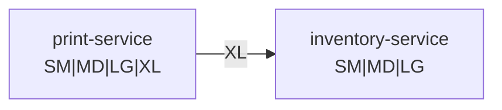

# Wire-safe enums

[](https://search.maven.org/artifact/com.egoodhall.tools/wire-safe-enums)
[](https://adoptium.net/)
[](https://kotlinlang.org/)
[](https://opensource.org/licenses/Apache-2.0)

Wrapper class for enums that supports deserialization of unknown enum values. This is
especially useful when handling enums sent across the wire between different JVMs, where
an enum value may not be known.

## Compatibility

### Java & Kotlin

- **Java**: 11+
- **Kotlin**: 2.2.0+
- **JVM Target**: 11+

### JSON Serialization Libraries

| Library               | Module                     | Supported Versions | Status    |
| --------------------- | -------------------------- | ------------------ | --------- |
| Jackson 2             | `wire-safe-enums-jackson2` | 2.16.1+            | ✅ Stable |
| Jackson 3             | `wire-safe-enums-jackson3` | 3.0.0+             | ✅ Stable |
| kotlinx.serialization | `wire-safe-enums-kotlinx`  | 1.9.0+             | ✅ Stable |
| Moshi                 | `wire-safe-enums-moshi`    | 1.15.2+            | ✅ Stable |

### Persistence Libraries

| Library   | Module                      | Supported Versions | Status    |
| --------- | --------------------------- | ------------------ | --------- |
| JDBI 3    | `wire-safe-enums-jdbi3`     | 3.53.0+            | ✅ Stable |
| Hibernate | `wire-safe-enums-hibernate` | 7.4.0+             | ✅ Stable |

### Platform Support

- **JVM**: Full support
- **Android**: Compatible (API level 21+)
- **Kotlin Multiplatform**: Not currently supported (JVM-only)

## Quick Start

Add the core dependency to your project:

**Gradle (Kotlin DSL):**

```kotlin
dependencies {
    implementation("com.egoodhall.tools:wire-safe-enums:${VERSION}")
}
```

**Maven:**

```xml
<dependency>
    <groupId>com.egoodhall.tools</groupId>
    <artifactId>wire-safe-enums</artifactId>
    <version>${VERSION}</version>
</dependency>
```

Then add the appropriate JSON serialization module for your preferred library (see [JSON Serialization](#json-serialization) section below).

## API

A `WireSafeEnum` can be either `Known` (the value is known to the current JVM) or
`Unknown` (the value is not known to the current JVM). Convenience methods are available
for constructing instances of `WireSafeEnum`, as well as an extension method on all enums
to allow easy conversion.

```kotlin
// Extension method provided for wrapping
val known = TeeShirtSize.MD.wireSafe()

// Known and Unknown can be created via factory methods
val otherKnown = WireSafeEnum.of(TeeShirtSize.MD)
val unknown = WireSafeEnum.of("XL")

// Unwrap using helper method
val unwrappedKnown: TeeShirtSize? = known.unwrap() // TeeShirtSize.MD
val unwrappedUnknown: TeeShirtSize? = unknown.unwrap() // null
```

## Why use WireSafeEnum?

Suppose we run a custom tee shirt printing business. In this example, we have two services:

- `inventory-service` - tracks how many shirts are available in each size (`SM`, `MD`, `LG`), material, etc.
- `print-service` - receives requests to print shirts, and updates the inventory via `inventory-service`

Let's say the sizes we support are represented as an enum in a shared library, and that we want
to add a new `XL` shirt size:

```kotlin
enum class TeeShirtSize {
  SM,
  MD,
  LG,
  XL, // New size!
}
```

Before it's safe to use the new value, **both** `inventory-service` and `print-service` would
need to be deployed. If either service has not been deployed with the updated enum, its JSON
parsing library will fail to parse `"XL"`, because it's not one of the known `TeeShirtSize`
values in the JVM.



In the example above, `print-service` has been deployed since the shared library was updated, so it
knows about the new `XL` value. We can see, though, that `inventory-service` has not yet been deployed,
so it's unaware of the new enum constant. This means that when it receives a JSON value of `"XL"` from
`print-service`, it will fail to deserialize the `TeeShirtSize`.

`WireSafeEnum` prevents such JSON deserialization failures, by deserializing into a "known" or
"unknown" wrapper type, which allows more graceful handling of unknown values. This is important
because it relaxes the requirements for distributed systems to be deployed in specific (and strict)
order before new values may be used.

> [!NOTE]
> `WireSafeEnum` does not solve the issue of actually handling the unknown values. It simply
> provides a more controlled way to manage unknown value deserialization (and re-serialization).
> You'll still need to figure out what behavior makes sense for your use-case.

## JSON Serialization

If the JSON string representing an enum can be successfully deserialized into an enum
constant, it will be wrapped in a `Known`, otherwise the (unquoted) JSON string will be
wrapped in an `Unknown`. Several common JSON serialization libraries are supported:

<details>
<summary><b>Jackson 2</b></summary>

### Installation:

**Gradle:**

```kotlin
// com.egoodhall.tools:wire-safe-enums is exposed as `api`, so you only need this dependency
implementation("com.egoodhall.tools:wire-safe-enums-jackson2:${VERSION}")
```

**Maven:**

```xml
<dependency>
  <groupId>com.egoodhall.tools</groupId>
  <artifactId>wire-safe-enums-jackson2</artifactId>
  <version>${VERSION}</version>
</dependency>
```

### Usage

Jackson support for `WireSafeEnum` is provided by the `WireSafeEnumModule`. Registering it with the
ObjectMapper will provide `JsonSerializers`/`JsonDeserializer`s that support the generics needed by
`WireSafeEnum`.

```kotlin
// Register the WireSafeEnumModule with the ObjectMapper
val mapper = ObjectMapper().apply {
  registerKotlinModule()
  registerModule(WireSafeEnumModule())
}

// Use the ObjectMapper to convert known values to/from JSON
val known = mapper.readValue<WireSafeEnum<TeeShirtSize>>("\"MD\"") // Known(TeeShirtSize.MD)
val knownJson = mapper.writeValueAsString(known) // "MD"

// Use the ObjectMapper to convert *unknown* values to/from JSON
val unknown = mapper.readValue<WireSafeEnum<TeeShirtSize>>("\"XL\"") // Unknown("XL")
val unknownJson = mapper.writeValueAsString(unknown) // "XL"
```

</details>

<details>
<summary><b>Jackson 3</b></summary>

### Installation:

**Gradle:**

```kotlin
// com.egoodhall.tools:wire-safe-enums is exposed as `api`, so you only need this dependency
implementation("com.egoodhall.tools:wire-safe-enums-jackson3:${VERSION}")
```

**Maven:**

```xml
<dependency>
  <groupId>com.egoodhall.tools</groupId>
  <artifactId>wire-safe-enums-jackson3</artifactId>
  <version>${VERSION}</version>
</dependency>
```

### Usage

Jackson support for `WireSafeEnum` is provided by the `WireSafeEnumModule`. Registering it with the
JsonMapper will provide `JsonSerializers`/`JsonDeserializer`s that support the generics needed by
`WireSafeEnum`.

```kotlin
// Register the WireSafeEnumModule with the ObjectMapper
val mapper = JsonMapper.builder()
	.addModule(kotlinModule())
	.addModule(WireSafeEnumModule())
	.build()

// Use the ObjectMapper to convert known values to/from JSON
val known = mapper.readValue<WireSafeEnum<TeeShirtSize>>("\"MD\"") // Known(TeeShirtSize.MD)
val knownJson = mapper.writeValueAsString(known) // "MD"

// Use the ObjectMapper to convert *unknown* values to/from JSON
val unknown = mapper.readValue<WireSafeEnum<TeeShirtSize>>("\"XL\"") // Unknown("XL")
val unknownJson = mapper.writeValueAsString(unknown) // "XL"
```

</details>

<details>
<summary><b>kotlinx.serialization</b></summary>

### Installation:

**Gradle:**

```kotlin
// com.egoodhall.tools:wire-safe-enums is exposed as `api`, so you only need this dependency
implementation("com.egoodhall.tools:wire-safe-enums-kotlinx:${VERSION}")
```

**Maven:**

```xml
<dependency>
  <groupId>com.egoodhall.tools</groupId>
  <artifactId>wire-safe-enums-kotlinx</artifactId>
  <version>${VERSION}</version>
</dependency>
```

### Usage

kotlinx.serialization support for `WireSafeEnum` is provided by the `WireSafeEnumModule`. Registering
it with the `Json` instance will provide a `WireSafeEnumSerializer` that supports the generics needed by
`WireSafeEnum`.

```kotlin
// Register the WireSafeEnumModule with the Json instance
val mapper = Json { serializersModule = WireSafeEnumModule }

// Use the Json instance to convert known values to/from JSON
val known = mapper.decodeFromString<WireSafeEnum<TeeShirtSize>>("\"MD\"") // Known(TeeShirtSize.MD)
val knownJson = mapper.encodeToString(known) // "MD"

// Use the Json instance to convert *unknown* values to/from JSON
val unknown = mapper.decodeFromString<WireSafeEnum<TeeShirtSize>>("\"XL\"") // Unknown("XL")
val unknownJson = mapper.encodeToString(unknown) // "XL"
```

</details>

<details>
<summary><b>Moshi</b></summary>

### Installation:

**Gradle:**

```kotlin
// com.egoodhall.tools:wire-safe-enums is exposed as `api`, so you only need this dependency
implementation("com.egoodhall.tools:wire-safe-enums-moshi:${VERSION}")
```

**Maven:**

```xml
<dependency>
  <groupId>com.egoodhall.tools</groupId>
  <artifactId>wire-safe-enums-moshi</artifactId>
  <version>${VERSION}</version>
</dependency>
```

### Usage

Moshi support for `WireSafeEnum` is provided by the `WireSafeEnumAdapterFactory`. Registering it
with the `Moshi` builder will provide a `JsonAdapter` that supports the generics needed by
`WireSafeEnum`.

```kotlin
// Register the WireSafeEnumModule with the Moshi builder
val moshi = Moshi.Builder()
  .add(WireSafeEnumAdapterFactory())
  .addLast(KotlinJsonAdapterFactory())
  .build()

// Get an adapter for
val adapter = moshi.adapter<WireSafeEnum<TeeShirtSize>>()

// Use the adapter to convert known values to/from JSON
val known = adapter.fromJson("\"MD\"") // Known(TeeShirtSize.MD)
val knownJson = adapter.toJson(known) // "MD"

// Use the adapter to convert *unknown* values to/from JSON
val unknown = adapter.fromJson("\"XL\"") // Unknown("XL")
val unknownJson = adapter.toJson(unknown) // "XL"
```

</details>

## Persistence

`WireSafeEnum` can also be persisted to relational databases. The semantics differ slightly from the JSON case: the `Unknown` variant is preserved whenever the underlying storage format can carry it (e.g. `VARCHAR`), but for compact storage formats like `INTEGER` ordinals an unmapped value is treated as a data integrity error rather than a forward-compatibility case — you own both sides of a database schema, so an unmapped ordinal generally means corruption, not a version skew.

<details>
<summary><b>JDBI 3</b></summary>

### Installation:

**Gradle:**

```kotlin
// com.egoodhall.tools:wire-safe-enums is exposed as `api`, so you only need this dependency
implementation("com.egoodhall.tools:wire-safe-enums-jdbi3:${VERSION}")
```

**Maven:**

```xml
<dependency>
  <groupId>com.egoodhall.tools</groupId>
  <artifactId>wire-safe-enums-jdbi3</artifactId>
  <version>${VERSION}</version>
</dependency>
```

### Usage

JDBI 3 support is provided by `WireSafeEnumPlugin`. Install it on your `Jdbi` instance and column mappers and argument factories are registered for all `WireSafeEnum<T>` types — no per-enum boilerplate.

```kotlin
val jdbi = Jdbi.create(dataSource)
  .installPlugin(KotlinPlugin())
  .installPlugin(KotlinSqlObjectPlugin())
  .installPlugin(WireSafeEnumPlugin())
```

The plugin defers to JDBI's existing enum mapping, so both name-based (default) and ordinal-based (`@EnumByOrdinal`) storage are supported. When reading a value that doesn't map to a known enum constant, a `VARCHAR` column is wrapped as `Unknown(string)`; non-string columns (e.g. `INTEGER`) throw, because there's no meaningful string to preserve.

```kotlin
data class TeeShirt(val id: Int, val size: WireSafeEnum<TeeShirtSize>)

interface TeeShirtDao {
  @SqlQuery("SELECT * FROM tee_shirts WHERE id = :id")
  fun get(id: Int): TeeShirt?

  @SqlUpdate("INSERT INTO tee_shirts (size) VALUES (:size)")
  fun insert(size: WireSafeEnum<TeeShirtSize>)
}
```

</details>

<details>
<summary><b>Hibernate</b></summary>

### Installation:

**Gradle:**

```kotlin
// com.egoodhall.tools:wire-safe-enums is exposed as `api`, so you only need this dependency
implementation("com.egoodhall.tools:wire-safe-enums-hibernate:${VERSION}")
```

**Maven:**

```xml
<dependency>
  <groupId>com.egoodhall.tools</groupId>
  <artifactId>wire-safe-enums-hibernate</artifactId>
  <version>${VERSION}</version>
</dependency>
```

### Usage

Hibernate support is provided via abstract JPA `AttributeConverter` base classes. Subclass one per enum, annotate with `@Converter(autoApply = true)`, and Hibernate will transparently apply it to every entity attribute of that type — no per-field annotations required.

Two converters are provided, depending on how the column is stored:

- `WireSafeEnumConverter<T>` — stores as `String` (the enum constant name). Round-trips both `Known` and `Unknown` values.
- `WireSafeEnumOrdinalConverter<T>` — stores as `Int` (the enum ordinal). Only `Known` values are supported; reading an unmapped ordinal or persisting an `Unknown` throws.

```kotlin
// String storage — preserves Unknown values
@Converter(autoApply = true)
class TeeShirtSizeConverter : WireSafeEnumConverter<TeeShirtSize>(TeeShirtSize::class.java)

// Ordinal storage — compact, but Unknown values are not representable
@Converter(autoApply = true)
class PriorityConverter : WireSafeEnumOrdinalConverter<Priority>(Priority::class.java)

@Entity
class TeeShirt {
  @Id @GeneratedValue var id: Long? = null
  lateinit var size: WireSafeEnum<TeeShirtSize> // auto-applied via TeeShirtSizeConverter
  lateinit var priority: WireSafeEnum<Priority>  // auto-applied via PriorityConverter
}
```

</details>
